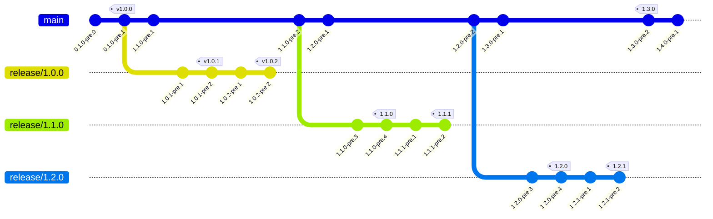

<div align=center>
  
</div>

# Git Versioner

[](https://trunkbaseddevelopment.com/)
[](https://github.com/crown0815/git-versioner/releases)
[](https://github.com/crown0815/git-versioner/actions/workflows/rust.yml)
[](https://github.com/crown0815/git-versioner/actions/workflows/release.yml)
[](https://github.com/Crown0815/git-versioner/issues/)
[](https://github.com/Crown0815/git-versioner/blob/-/LICENSE.txt)




A Rust application designed to automatically calculate version numbers for Git repositories employing trunk-based development with release branches.

## Table of Contents

- [Introduction](#introduction)
- [Features](#features)
- [Installation](#installation)
- [Usage](#usage)
- [Configuration](#configuration)
- [Contributing](#contributing)
- [License](#license)
- [Inspiration](#inspiration)

## Introduction

Git Versioner is a command-line tool developed in Rust that facilitates automated versioning in Git repositories. 
It is particularly suited for workflows using trunk-based development, where the primary branch (referred to as "trunk") serves as the main line of integration, and release branches are created to stabilize specific versions.
The tool analyzes the repository's commit history, branches, and tags to derive semantic version numbers, including pre-release identifiers such as "-pre.X" for development builds.

This project aims to streamline release management by eliminating manual version updates, ensuring consistency, and supporting parallel development on multiple release lines.
It draws inspiration from established versioning tools while focusing on simplicity and integration with modern Git practices.

## Features

- **Automated Version Calculation**: Derives version numbers based on commit history, branch structure, and existing tags.
- **Support for Trunk-Based Development**: Recognizes the "trunk" as the main branch and handles release branches (e.g., "release/1.0.0") for patch and minor updates.
- **Semantic Versioning Compliance**: Generates versions in the format `MAJOR.MINOR.PATCH-pre.X` for pre-releases and `MAJOR.MINOR.PATCH` for stable tags.
- **Tag Management**: Identifies and applies tags for stable releases (e.g., "v1.0.0").
- **Configurable Branch Naming**: Allows customization of the main branch name (default: "trunk").
- **Integration-Friendly**: Suitable for use in continuous integration/continuous deployment (CI/CD) pipelines.

## Installation

To install Git Versioner, ensure you have Rust and Cargo installed on your system.
Rust can be obtained via [rustup](https://rustup.rs/).

1. Clone the repository:
   ```
   git clone https://github.com/Crown0815/git-versioner.git
   cd git-versioner
   ```

2. Build the project:
   ```
   cargo build --release
   ```

3. Install the binary (optional, for global access):
   ```
   cargo install --path .
   ```

The executable will be available in the `target/release` directory or in your Cargo bin path if installed globally.

## Usage

Once installed, run Git Versioner from the root of your Git repository to compute the current version:

```
git-versioner
```

This command will output the calculated version string based on the repository's state.

### Command-Line Options

- `--config <PATH>`: Specify a custom configuration file (default: none).
- `--branch <NAME>`: Override the main branch name (default: "trunk").
- `--help`: Display usage information.

For integration in scripts or CI/CD, capture the output for use in build artifacts or tags.

The command line options allow overwriting of configuration options using (see also [Configuration](#configuration))

```shell
      --main-branch <MAIN_BRANCH>          
      --release-branch <RELEASE_BRANCH>    
      --feature-branch <FEATURE_BRANCH>    
      --tag-prefix <TAG_PREFIX>            
      --pre-release-tag <PRE_RELEASE_TAG>  
```

Additionally, the following options are supported:

```shell

  -p, --path <PATH>                        
  -v, --verbose                            
  -c, --config <CONFIG_FILE>               Path to a configuration file (TOML or YAML)
  -h, --help                               Print help
  -V, --version                            Print version
```

For integration in scripts or CI/CD, capture the output for use in build artifacts or tags.

## Configuration

Git Versioner supports a YAML or TOML configuration file to customize its behavior. 
Create a file named `.git-versioner.toml`, `.git-versioner.yaml`, or `.git-versioner.yml` in the repository root.
All fields are optional and will fall back to internal defaults if not specified. 

An example configuration is as follows:

```yaml
MainBranch: "^trunk$"
ReleaseBranch: "^release/(?<BranchName>.+)$"
FeatureBranch: "feature/(?<BranchName>.+)$"
TagPrefix: "[vV]?"
PreReleaseTag: "pre"
```

### Configuration Fields
- **MainBranch**: Specifies the pattern of the main development branch (default: `^(trunk|main|master)$`).
- **ReleaseBranch**: Defines the pattern for release branches (default: `^releases?[/-](?<BranchName>.+)$`).
- **FeatureBranch**: Defines the pattern for feature branches (default: `^features?[/-](?<BranchName>.+)$`).
- **TagPrefix**: Defines the prefix of versions on tags and release branches' `BranchName` (default: `^[vV]?`).
- **PreReleaseTag**: The identifier used for pre-release versions (default: `pre`).

Additional options may be added in future releases to support advanced versioning rules.

## Contributing

Contributions are welcome to enhance Git Versioner.
To contribute:

1. Fork the repository on GitHub.
2. Create a new branch for your feature or bug fix: `git checkout -b feature/your-feature`.
3. Commit your changes with clear messages.
4. Push to your fork: `git push origin feature/your-feature`.
5. Open a pull request, describing the changes and referencing any related issues.

Please adhere to Rust's coding standards, include tests for new features.
For major changes, discuss them in an issue first.

## License

This project is licensed under the MIT License.
See the [LICENSE](LICENSE.txt) file for details.

## Inspiration

This tool is heavily inspired and mimics the outputs generated by [GitVersion](https://gitversion.net).
