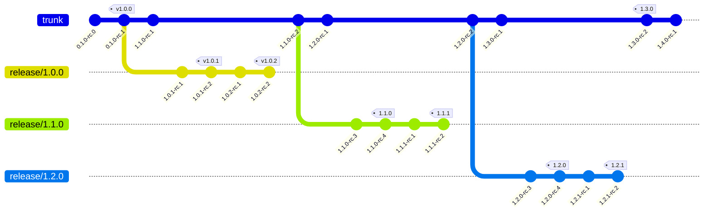

# Git Versioner

A Rust application that automatically calculates version numbers for Git repositories using trunk-based development with release branches.

### Example

```mermaid
---
config:
  theme: default
  gitGraph:
    mainBranchName: 'trunk'
---
gitGraph:
    commit id: "0.1.0-rc.0"
    commit id: "0.1.0-rc.1" tag: "v1.0.0"
    branch release/1.0.0
    checkout trunk
    commit id: "1.1.0-rc.1"
    checkout release/1.0.0
    commit id: "1.0.1-rc.1"
    commit id: "1.0.1-rc.2 " tag: "v1.0.1"
    commit id: "1.0.2-rc.1"
    commit id: "1.0.2-rc.2" tag: "v1.0.2"
    checkout trunk
    commit id: "1.1.0-rc.2"
    branch release/1.1.0
    checkout trunk
    commit id: "1.2.0-rc.1"
    checkout release/1.1.0
    commit id: "1.1.0-rc.3"
    commit id: "1.1.0-rc.4" tag: "1.1.0"
    commit id: "1.1.1-rc.1"
    commit id: "1.1.1-rc.2" tag: "1.1.1"
    checkout trunk
    commit id: "1.2.0-rc.2"
    branch release/1.2.0
    checkout trunk
    commit id: "1.3.0-rc.1"
    checkout release/1.2.0
    commit id: "1.2.0-rc.3"
    commit id: "1.2.0-rc.4" tag: "1.2.0"
    commit id: "1.2.1-rc.1"
    commit id: "1.2.1-rc.2" tag: "1.2.1"
    checkout trunk
    commit id: "1.3.0-rc.2" tag: "1.3.0"
    commit id: "1.4.0-rc.1"
```
