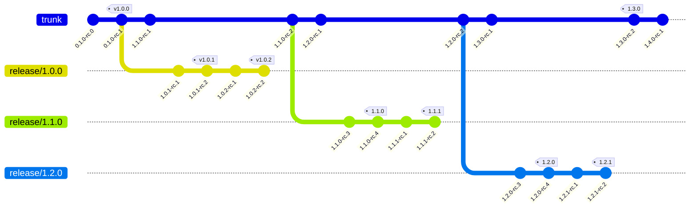

# Git Versioner

A Rust application that automatically calculates version numbers for Git repositories using trunk-based development with release branches.

## Features

- Automatic version calculation based on Git repository state
- Support for trunk-based development workflow
- Handling of release branches and release candidates
- Simple command-line interface

## Installation

Clone the repository and build with Cargo:

```bash
git clone https://github.com/yourusername/git-versioner.git
cd git-versioner
cargo build --release
```

The compiled binary will be available at `target/release/git-versioner`.

## Usage

Run the application in your Git repository:

```bash
git-versioner
```

This will output the calculated version number based on your repository's state.

Options:
- `-r, --repo-path <PATH>`: Specify a custom repository path (defaults to current directory)
- `-v, --verbose`: Print detailed version information
- `-h, --help`: Show help information

## How It Works

Git Versioner follows a trunk-based development model with the following rules:

1. The main development branch is called `trunk` (also recognizes `main` or `master`)
2. Release branches are named `release/X.Y.Z` (e.g., `release/1.0.0`)
3. Version tags follow semantic versioning with optional `v` prefix (e.g., `v1.0.0` or `1.0.0`)
4. Release candidates are tagged with `-rc.N` suffix (e.g., `v1.0.0-rc.1`)

### Version Calculation Logic

- **On trunk branch**:
  - If no tags exist: `0.1.0-rc.0`
  - If tags exist: Increment minor version, reset patch to 0, add `-rc.N` suffix
  
- **On release branch**:
  - If no tags exist on the branch: Use branch version with `-rc.1` suffix
  - If the latest tag is a release (no pre-release component): Increment patch version, add `-rc.1` suffix
  - If the latest tag is a release candidate: Increment RC number

### Example Workflow



## License

MIT