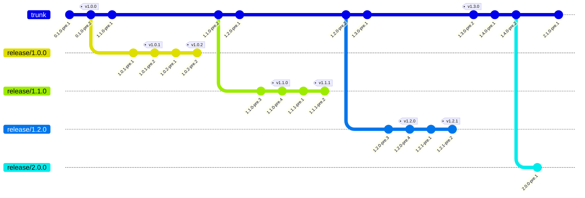

# Trunk-based Development

```mermaid
---
config:
  theme: default
  gitGraph:
    mainBranchName: "trunk"
---
gitGraph:
   checkout "trunk"
   commit id: "0.1.0-pre.1"
   commit id: "0.1.0-pre.2" tag: "v1.0.0"
   branch "release/1.0.0"
   checkout "trunk"
   commit id: "1.1.0-pre.1"
   checkout "release/1.0.0"
   commit id: "1.0.1-pre.1"
   commit id: "1.0.1-pre.2" tag: "v1.0.1"
   commit id: "1.0.2-pre.1"
   commit id: "1.0.2-pre.2" tag: "v1.0.2"
   checkout "trunk"
   commit id: "1.1.0-pre.2"
   branch "release/1.1.0"
   checkout "trunk"
   commit id: "1.2.0-pre.1"
   checkout "release/1.1.0"
   commit id: "1.1.0-pre.3"
   commit id: "1.1.0-pre.4" tag: "v1.1.0"
   commit id: "1.1.1-pre.1"
   commit id: "1.1.1-pre.2" tag: "v1.1.1"
   checkout "trunk"
   commit id: "1.2.0-pre.2"
   branch "release/1.2.0"
   checkout "trunk"
   commit id: "1.3.0-pre.1"
   checkout "release/1.2.0"
   commit id: "1.2.0-pre.3"
   commit id: "1.2.0-pre.4" tag: "v1.2.0"
   commit id: "1.2.1-pre.1"
   commit id: "1.2.1-pre.2" tag: "v1.2.1"
   checkout "trunk"
   commit id: "1.3.0-pre.2" tag: "v1.3.0"
   commit id: "1.4.0-pre.1"
   commit id: "1.4.0-pre.2"
   branch "release/2.0.0"
   commit id: "2.0.0-pre.1"
   checkout "trunk"
   commit id: "2.1.0-pre.1"
```