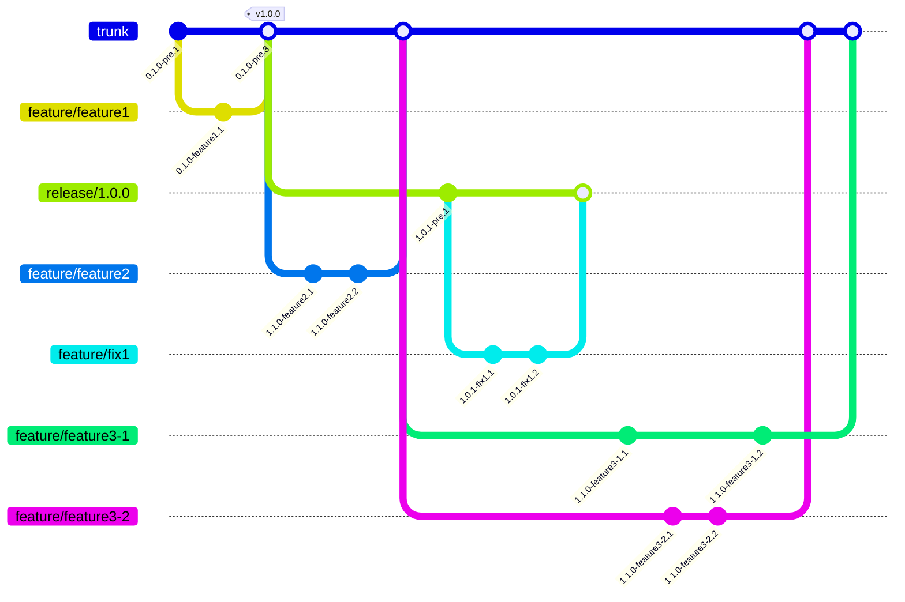

# Trunk-based Development with Feature Branches

```mermaid
---
config:
  theme: default
  gitGraph:
    mainBranchName: "trunk"
---
gitGraph:
   checkout "trunk"
   commit id: "0.1.0-pre.1"
   branch "feature/feature1"
   commit id: "0.1.0-feature1.1"
   checkout "trunk"
   merge "feature/feature1" id: "0.1.0-pre.3" tag: "v1.0.0"
   branch "release/1.0.0"
   checkout "trunk"
   branch "feature/feature2"
   commit id: "1.1.0-feature2.1"
   commit id: "1.1.0-feature2.2"
   checkout "trunk"
   merge "feature/feature2"
   checkout "release/1.0.0"
   commit id: "1.0.1-pre.1"
   branch "feature/fix1"
   commit id: "1.0.1-fix1.1"
   commit id: "1.0.1-fix1.2"
   checkout "release/1.0.0"
   merge "feature/fix1"
   checkout "trunk"
   branch "feature/feature3-1"
   commit id: "1.1.0-feature3-1.1"
   checkout "trunk"
   branch "feature/feature3-2"
   commit id: "1.1.0-feature3-2.1"
   commit id: "1.1.0-feature3-2.2"
   checkout "feature/feature3-1"
   commit id: "1.1.0-feature3-1.2"
   checkout "trunk"
   merge "feature/feature3-2"
   merge "feature/feature3-1"
```